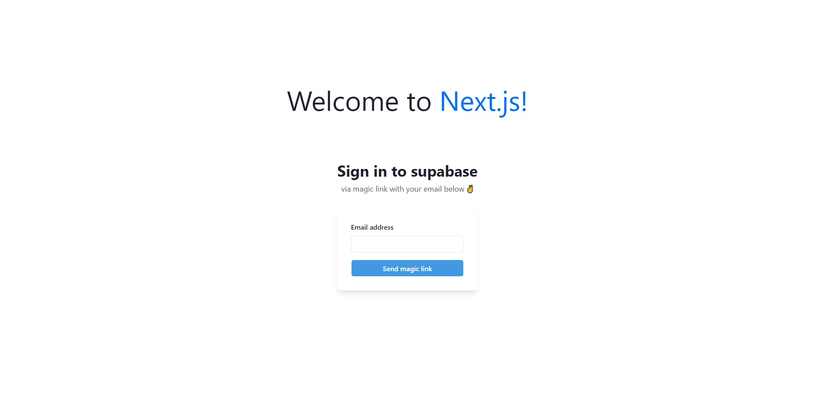
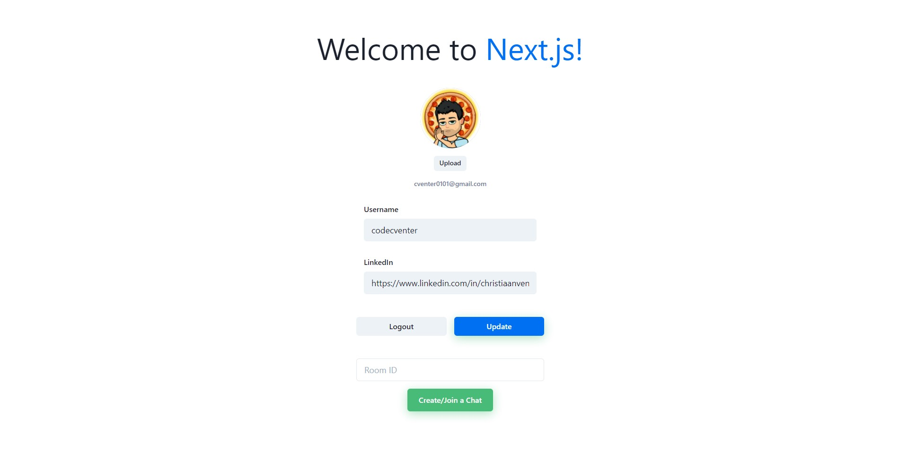
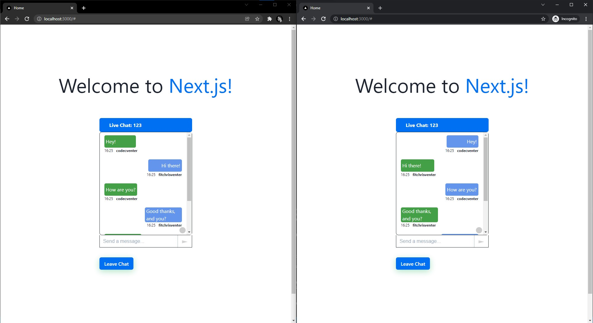

## Next.js Chat App
This simple real-time chat application was developed using Next.js, Socket.io and Supabase and allows users to join a private chat room while having the ability to host group chats.

## Motivation
After building client-server applications with web sockets using Java, I was really eager to create a React based application using Socket.io and Supabase for user authentication.

## Screenshots




## Tech/framework used
- [Next.js](https://nextjs.org/)
- [Socket.io](https://socket.io/)
- [Supabase](https://supabase.com/)

## Features
- Join or create private chat rooms
- Group chat functionality
- Update profile

## Installation
1. Clone the project:
```
git clone https://github.com/codecventer/nextjs-chatapp.git
```
2. Install dependencies on server application:
```
cd server
npm install
```
3. Install dependencies on client application:
```
cd ../client
npm install
```
4. From the root directory in the client application, create .env.local file for your own Supabase credentials and store your Supabase project URL and Supabase Anon Key as environmental variables - e.g NEXT_PUBLIC_SUPABASE_URL="https://your-supabase-url.supabase.co"
5. Start the server:
```
cd ../server
npm run start
```
6. Start the client application:
```
cd ../client
npm run dev
```
7. Open localhost in your browser.

## API Reference
- [Supabase Client API](https://supabase.com/docs/reference/javascript/supabase-client)
- [Socket.io API](https://socket.io/docs/v4/)
- [Next.js](https://nextjs.org/)

## How to use?
Once localhost is up and running in your browser, go ahead and enter your email address in the displayed textfield and click the 'Send magic link' button. You should then receive an email shortly, containing a link which you can use to either authenticate or log into your account.

Once logged in, you can update your username or LinkedIn URL. But ultimately you can create or join a chat room by typing the room ID before clicking on 'Create/Join a Chat'. The real magic happens when you log into a different account (also with localhost) using a private browser window such a Chrome incognito window.

Once logged into another account you can now create a chat room with an ID of, e.g 123, and join the exact same chat room with the additional profile. You can now start to chat!

## Author
- [Christiaan Venter](https://github.com/codecventer)
